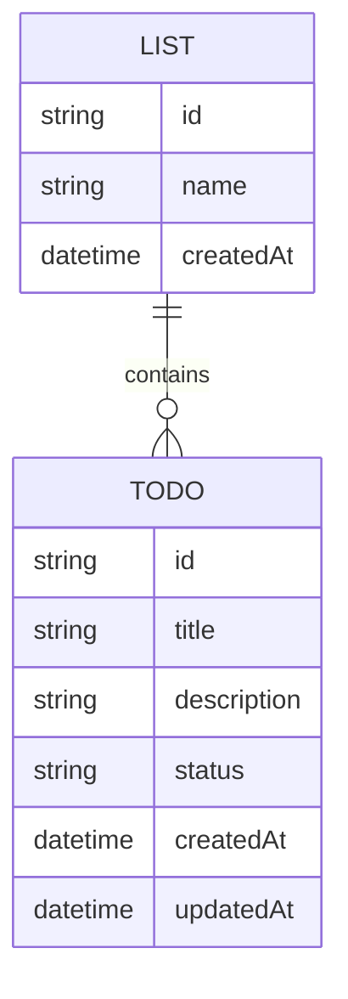
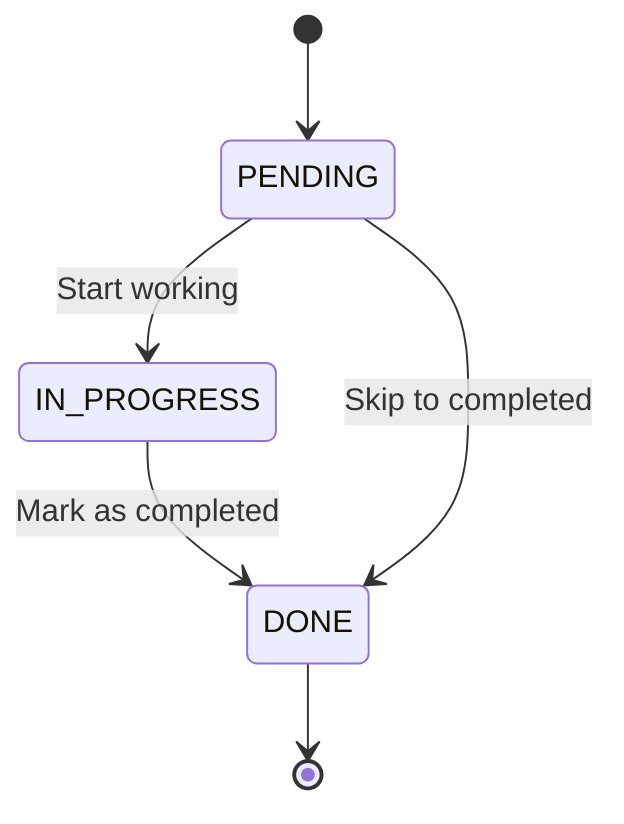

## 개요

이 문서는 ToDo List 시스템의 주요 개념과 이들 간의 관계를 시각적으로 설명합니다. 또한, ToDo 항목의 상태 변화 과정을 다이어그램으로 명확히 나타냅니다.

### 1 List와 ToDo의 관계

ToDo List 시스템에서 List와 ToDo는 다음과 같은 관계를 가집니다:

- 하나의 List는 여러 개의 ToDo를 포함합니다.
- 각 ToDo는 반드시 하나의 List에 속합니다.

- List는 작업을 그룹화하는 기본 단위이며, ToDo는 개별 작업 항목입니다.
- 관계 다이어그램은 LIST와 TODO의 1:N 관계를 명확히 나타냅니다.

### 2 ToDo의 상태 변화

ToDo 항목은 다음과 같은 상태 전환 과정을 거칩니다:

1. PENDING: 초기 상태로, 작업이 생성되었으나 아직 시작되지 않음.
2. IN_PROGRESS: 작업이 진행 중인 상태.
3. DONE: 작업이 완료된 상태.

- 상태 설명:
- PENDING에서 바로 DONE으로 건너뛸 수 있어 유연성을 제공합니다.
- 상태 변화는 API를 통해 관리되며, 각 전환은 작업 진행 상황을 반영합니다.
